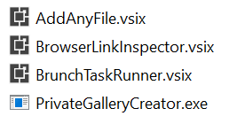
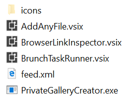
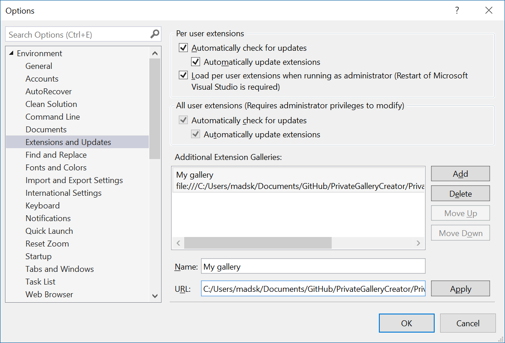

# Create VSIX private gallery ATOM feed

[Go to download site](https://ci.appveyor.com/project/madskristensen/privategallerycreator/build/artifacts)

-----------------------------

This project creates a [private extension gallery](https://msdn.microsoft.com/en-us/library/hh266746.aspx) that can be consumed by Visual Studio to side-load extensions that are not on the official marketplace.

You may want to use this to provide a marketplace of private extensions for testing purposes or for extensions that are for internal use only.

This project is a simple .exe file that will generate a valid ATOM file from a directory of .vsix files.

## Getting started
Place all the VSIX files you want to include in the private gallery in the same folder. Then download and add the [PrivateGalleryCreator.exe](https://ci.appveyor.com/project/madskristensen/privategallerycreator/build/artifacts) file and place in the same folder. It should look similar to this:

Now double-click the *PrivateGalleryCreator.exe* to generate the ATOM feed. It will parse the .vsix files for the information needed and extract the icon files. Your folder should now look like this:

You may not see the *Icons* folder if you don't have any icons registered in the VSIX files or if Windows Explorer doesn't show hidden files and folders. So, don't worry if you don't see it. The ATOM feed will still work.

You can now add the gallery to Visual Studio to have the extensions automatically show up.

The **URL** should be the absolute path to the *feed.xml* file. The path can be a network share (e.g. \\\\mycompany\extensions\feed.xml).

## Good to know

* Run the *PrivateGalleryCreator.exe* every time you add or update a .vsix in the directory
* Visual Studio will by default auto-update extensions - including the ones from private galleries.
* The feed support extensions for Visual Studio 2010 and newer