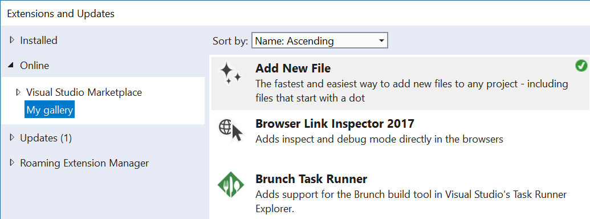

# Private Gallery Creator

[](https://github.com/madskristensen/PrivateGalleryCreator/actions/workflows/ci.yml)

A command-line tool that generates a private extension gallery for Visual Studio from a folder of `.vsix` files.

[Download the latest release](https://github.com/madskristensen/PrivateGalleryCreator/releases)

## Why use this?

The Visual Studio Marketplace is great for public extensions, but sometimes you need to distribute extensions that should not be publicly listed. Common scenarios include:

- **Internal tooling.** Your team builds VS extensions for internal use (code generators, project templates, custom analyzers) and needs a central place to install and update them.
- **Pre-release testing.** You want to distribute beta builds of an extension to a test group before publishing to the Marketplace.
- **Offline or restricted environments.** Your development machines cannot reach the public Marketplace, but can access a shared network folder or internal web server.

Visual Studio has built-in support for [private extension galleries](https://learn.microsoft.com/en-us/visualstudio/extensibility/private-galleries), but you need to provide a valid ATOM feed that describes the available extensions. This tool generates that feed automatically by reading the metadata from your `.vsix` files.

## Getting started

### 1. Set up a folder with your extensions

Create a folder and place the `.vsix` files you want to distribute inside it. Then add `PrivateGalleryCreator.exe` to the same folder.


### 2. Generate the feed

Double-click `PrivateGalleryCreator.exe` (or run it from the command line). It will:

1. Parse each `.vsix` file for metadata (name, version, author, description, etc.)
2. Extract extension icons into a hidden `icons` folder
3. Generate a `feed.xml` file in the same directory


> **Note:** The `icons` folder is hidden. If you don't see it, that's expected. The feed will still work correctly.

### 3. Register the gallery in Visual Studio

Open Visual Studio and go to **Tools > Options > Environment > Extensions**. Add a new gallery with the absolute path to the `feed.xml` file. This can be a local path or a network share.

```
\\mycompany\extensions\feed.xml
```


The private gallery will now appear under the **Online** tab in the Extensions dialog (**Extensions > Manage Extensions**).



### 4. Keep it updated

Run `PrivateGalleryCreator.exe` again whenever you add, remove, or update a `.vsix` file. Or use the `--watch` option to regenerate the feed automatically on changes (see below).

## Command-line options

All options can be combined. For example:

```cmd
PrivateGalleryCreator.exe --input=C:\extensions --output=C:\feed\feed.xml --name="Team Extensions" --recursive --latest-only --terminate
```

### `--input`

Sets the directory to scan for `.vsix` files. Defaults to the directory containing the exe.

```cmd
PrivateGalleryCreator.exe --input=C:\your\extensions\folder
```

### `--output`

Sets the output path for the generated feed file. Defaults to `feed.xml` in the input directory.

```cmd
PrivateGalleryCreator.exe --output=C:\your\path\feed.xml
```

### `--name`

Sets a custom gallery name. Defaults to `"VSIX Gallery"`.

```cmd
PrivateGalleryCreator.exe --name="My Team Gallery"
```

### `--recursive`

Scans subdirectories for `.vsix` files in addition to the input directory.

```cmd
PrivateGalleryCreator.exe --recursive
```

### `--latest-only`

When multiple versions of the same extension are found, only the latest version is included in the feed. Useful when your folder retains previous versions.

```cmd
PrivateGalleryCreator.exe --latest-only
```

### `--exclude`

Skips any `.vsix` files whose full path contains the specified text.

```cmd
PrivateGalleryCreator.exe --exclude=experimental
```

### `--source`

Overrides the download URL used in the feed. By default, the feed references extensions relative to the feed file location. Use this option when the `.vsix` files will be served from a different location than where you run the tool.

```cmd
PrivateGalleryCreator.exe --source=https://myserver.com/extensions/
PrivateGalleryCreator.exe --source=\\mycompany\shared\extensions\
```

### `--watch` (`-w`)

Watches the input directory for changes to `.vsix` files and regenerates the feed automatically. The process runs continuously until you close the console or press `Ctrl+C`.

```cmd
PrivateGalleryCreator.exe --watch
```

### `--terminate` (`-t`)

Exits immediately after generating the feed. Without this option, the tool waits for a keypress before closing. Useful for scripts and CI pipelines.

```cmd
PrivateGalleryCreator.exe --terminate
```

### `--version`

Sets the target Visual Studio version for the feed. Defaults to `17.0`. This affects how extension pack IDs are serialized in the feed. Valid values are `11.0` through `17.x`.

```cmd
PrivateGalleryCreator.exe --version=16.0
```

## Tips

- Visual Studio auto-updates extensions from private galleries, just like it does for Marketplace extensions.
- The feed supports extensions targeting Visual Studio 2012 and newer.
- You can register a private gallery through a VS extension using a `.pkgdef` file. See [this example](https://github.com/madskristensen/VsixGalleryExtension/blob/master/src/feed.pkgdef).
- For CI/CD pipelines, combine `--input`, `--output`, `--source`, and `--terminate` to generate the feed as a build step.

## License

[Apache 2.0](LICENSE)
